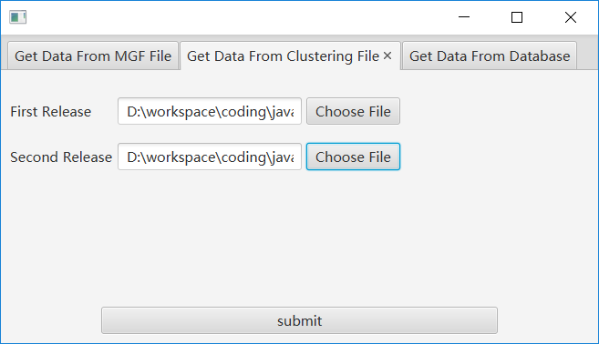
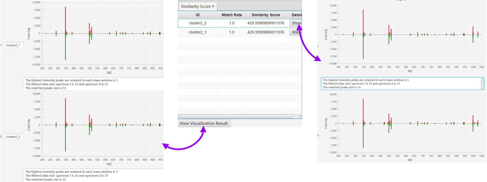
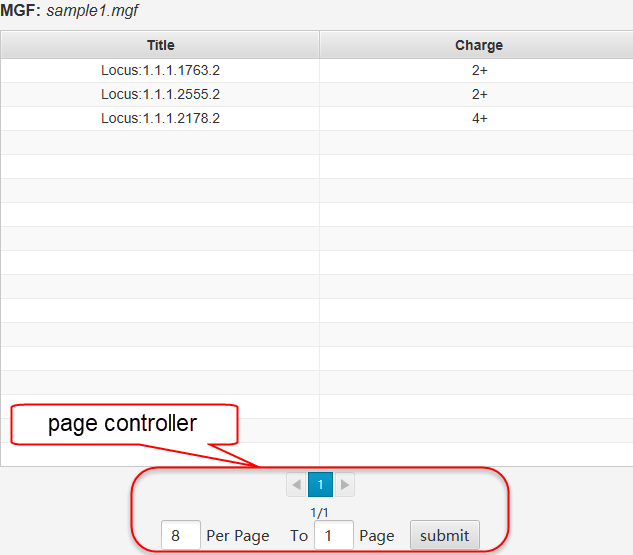

# Introduction
The **Cluster Comparer GUI** is a software focused on proteomics mass spectrometry data analysis. The main functions are:

1. Similarity score for spectra(currently supported file formats include MGF file format and `*.clustering` file format).

2. Basical analusis and visualization of spectra clustering results(currently supported file format include `clustering` format).

> The similarity score algorithm used by the  software can be found in the paper[(A Pipeline for Differential Proteomics in Unsequenced Species)](https://pubs.acs.org/doi/abs/10.1021/acs.jproteome.6b00140).

> `*.clustering` file is a result file format for MS/MS based spectrum clustering. A detailed description of the `*.clustering` file format can be found at [https://github.com/spectra-cluster/clustering-file-reader](https://github.com/spectra-cluster/clustering-file-reader).

# Analysis and Visualization of `*.clustering` Files

## 1. Data Import

Select `File` > `Import Data` in the menu bar, select `Get Data From Clustering File` in the popup window, and the select and submit the `*.clustering` file to be analysis.  Because comparison need two object, you need to enter two files.



## 2. Result

### cluster table and spectrum table

**cluster table** and **spectrum table** shows the content of `*.clustering` file in tables. Each row in the **cluster table** shows a `cluster`. **spectrum table** shows the information of spectra contained in the currently selected `cluster`.


Supported Operation:
- Click the button `switch` to display the content of another `*.clustering` file.
- When clicking different clusters in **cluster table**, **spectrum table**, **peak map**, **pie chart** and **network graph** will show the result of the corresponding `cluster`.
- Change the number of result displayed on each page by **page controller**, and you can use the controller to jump the specified page number.

### peak map

**peak map** shows all the peaks of specified `cluster` in the **cluster table**.


Supported Operation

- Adjust color with color selector
- Zoom in to display the peaks in the rectangular selection area(left mouse button drag selection)

### pie chart
**pie chart** shows the distribution of the spectra contained in the specified `cluster` in another `*.clustering` file.


Give an example to illustrate the meaning of the pie chart:


- File I: sample1.clustering

```
=Cluster=
id=cluster1_1
av_precursor_mz=348.128
av_precursor_intens=1.0
consensus_mz=227.292,288.314,...
consensus_intens=29.8,693.84,191.04,...
SPEC	spec1			348.12817	3.0			0.0
SPEC	spec2			348.12817	3.0			0.0
SPEC	spec3			348.12817	3.0			0.0
SPEC	spec4			348.12817	3.0			0.0

=Cluster=
id=cluster1_2
av_precursor_mz=348.128
av_precursor_intens=1.0
consensus_mz=227.292,288.314,...
consensus_intens=29.8,693.84,...
SPEC	spec5			348.12817	3.0			0.0
SPEC	spec7			348.12817	3.0			0.0
SPEC	spec8			348.12817	3.0			0.0
SPEC	spec9			348.12817	3.0			0.0
SPEC	spec10			348.12817	3.0			0.0
```

- File II: sample2.Clustering

```
=Cluster=
id=cluster2_1
av_precursor_mz=348.128
av_precursor_intens=1.0
consensus_mz=227.292,288.314,...
consensus_intens=29.8,693.84,...
SPEC	spec4			348.12817	3.0			0.0
SPEC	spec5			348.12817	3.0			0.0
SPEC	spec6			348.12817	3.0			0.0
SPEC	spec7			348.12817	3.0			0.0
SPEC	spec8			348.12817	3.0			0.0
SPEC	spec9			348.12817	3.0			0.0

=Cluster=
id=cluster2_2
av_precursor_mz=348.128
av_precursor_intens=1.0
consensus_mz=227.292,288.314,...
consensus_intens=29.8,693.84,...
SPEC	spec1			348.12817	3.0			0.0
SPEC	spec2			348.12817	3.0			0.0
SPEC	spec3			348.12817	3.0			0.0

=Cluster=
id=cluster2_3
av_precursor_mz=348.128
av_precursor_intens=1.0
consensus_mz=227.292,288.314,...
consensus_intens=29.8,693.84,191.04,...
SPEC	spec10			348.12817	3.0			0.0
SPEC	spec11			348.12817	3.0			0.0
```

The `cluster1_1` in *sample1.clustering* contains spectra {spec1, spec2, spec3, spec4}, which are scattered in cluster2_1{spec4} and cluster2_2{spec1, spec2, spec3} in *sample2.clustering*. This is the meaning of the above pie chart.

Supported Operation:
- Click the block of pie chart to show the comparison of two cluster. The first cluster is the currently specified cluster and the second cluster is from another `*.clustering` file.

  - Overlapped spectra in two cluster are highlighted.
  - The peak map shows the comparison of peaks of the two cluster and you can use the previously described operation to adjust its display.


- Do Similarity Score

  Click the button `Do Similarity Score` will perform similarity score between the specified cluster and all clusters displayed in the pie chart(the above example will do similarity score for cluster1_1 vs cluster2_1 and cluster2_2).

  - ID: same as **ID** in **cluster table**.
  - Match Rate: the rate of the peaks matched by two spectra under consideration of the fragment tolerance(the number of matched peaks / maxium of tho spectra peaks after processed )
  - Similarity Score: similarity score result Higher similarity score are more similar.
  - Detail: click the buttom `Show` to display the report of each iteration result.

    - The filtered data has a certain degree of transparency, and the data used for calculation is opaque.
  - Click button **View Visualization Result**  to show visual comparison result, which displays the report of the highest similarity score during two cluster alignment.




### network graph


The **network graph** shows the cluster specified in **cluster table** is used as the starting point to search the distribution of its related spectra in two `*.clustering` files. This is different from the search way in pie chart. Specially, we can give an example to explain the meaning of **network graph**(we still use `sample1.clustering` and `sample2.clustering` given above).


The spectra in cluster1_1 are scattered in cluster2_1 and clustering_2_2, but the cluster2_1 also contains spectra {spec5, spec7, spec8, spec9} not in cluster1_1. These spectra are clustered into cluster1_2. And spec10 in cluster1_2 is in cluster2_3. In order to express this relationship in the **network graph**, we use the node storage cluster and use edges to connect nodes with overlapping spectra. The vertical width of the nodes represents the number of spectra contained in the cluster, and the vertical width of the edges represents the number of spectra shared by two clusters.

Supported Operation:
- Click on the node to display the cluster information
- Click on the edge to show the alignment of the two clusters
- Use the controller to adjust the display of **network graph**

# Analysis and Visualization of MGF Files

## 1. 读取数据

Select `File` > `Import Data` in the menu bar, select `Get Data From MGF File` inthe popup window, and then select and submit the MGF files to be analysis. Because comparison need two object, you need to enter two files.


## 2. Result

### MGF table

**MGF table** shows the content of MGF file in tables. Each row in **MGF table** shows a spectrun.



Supported Operation
- Click on the different spectra in table, **Similarity Score Table** and **Peak Map** will change accordingly

## Similarity Score table

**Similarity Score table** shows the similarity score between the current spectrum and all the spectra in another file.


- ID: same as `Title` of **MGF table**.
> Other properties are the same as description in **Do Similarity Score**

# Next Version

- [ ] Modify the organizational form of the relevant code to decouple
- [ ] Modify GUI view.
